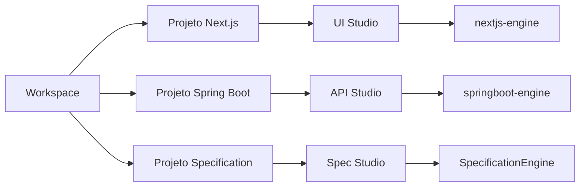

# Guia de Funcionalidades — IGRP Studio

> Documento de compreensão do produto para equipas, onboarding e stakeholders.  
> Versão de referência: **0.2.0-beta.19** · App: **IGRP Studio Horizon**

---

## 1. O que é o IGRP Studio?

O **IGRP Studio** é um IDE desktop (Electron) para o ecossistema **IGRP Framework**. Serve para **desenhar, organizar e gerar** aplicações empresariais de forma visual (low-code), sem substituir o código — gera e mantém artefatos que os engines transformam em projetos reais.

Em termos práticos, a aplicação permite:

- Organizar trabalho em **workspaces** e **projetos**
- Desenhar **interfaces Next.js** (UI Studio / Page Builder)
- Modelar **APIs Spring Boot** (API Studio)
- Conduzir projetos de **especificação assistida por IA** (Specification Studio)
- Integrar **Git** (GitHub / GitLab), **Docker**, **ligações a bases de dados** e o **IGRP CLI**

**Princípio importante:** o Studio orquestra a experiência; a geração pesada de código vive em packages de engine (`@igrp/igrp-studio-nextjs-engine`, `@igrp/igrp-studio-springboot-engine`, etc.).

---

## 2. Mapa da aplicação

| Área | Como se chega | Para quê |
|------|---------------|----------|
| **Welcome / Onboarding** | Primeira abertura | Apresentar o produto, validar ambiente (Doctor), instalar IGRP CLI |
| **Ecrã inicial do workspace** | Home após workspace ativo | Projetos, Serviços Docker, Configurações do workspace |
| **UI Studio** | Abrir projeto Next.js | Páginas, componentes, permissões, BPMN, preview |
| **API Studio** | Abrir projeto Spring Boot | Endpoints, models, contracts, GraphQL, ERD |
| **Specification Studio** | Abrir projeto AI Specification | Knowledge, Documents, Data, Prototype, Processes |
| **Conexões** | Menu / rota de conexões | Gerir ligações a bases de dados |
| **MarkItDown** | Ferramenta dedicada | Converter ficheiros para Markdown (KB / docs) |
| **Definições da app** | Ícone de configurações no header | Idioma, contas Git, IA, aparência, atualizações |

### Chrome global (barra superior)

Em quase todos os ecrãs de projeto encontra:

- Voltar ao home do workspace  
- Seletor de **workspace**  
- **Git**: branch + sync  
- Abrir pasta no Finder/Explorer  
- Abrir no IDE externo (VS Code, etc.)  
- Tema claro / escuro  
- Notificações  
- Autenticação GitHub / GitLab  
- Definições da aplicação  

---

## 3. Conceitos-chave

### Workspace

Um **workspace** é o contentor de trabalho: pasta no disco + metadados dos projetos + (opcionalmente) serviços Docker associados.

- Pode criar vários workspaces e alternar entre eles  
- Sem workspace ativo, o Studio pede a criação de um novo  

### Projeto

Um **projeto** pertence a um workspace e tem um **framework / tipo**:

| Tipo | Nome na UI | Abre em | Estado |
|------|------------|---------|--------|
| `nextjs` | NextJs | UI Studio | Suportado |
| `springboot` | Spring Boot | API Studio | Suportado |
| `specification` | AI Specification | Spec Studio | Suportado |
| `dotnet` | .NET | — | Listado; suporte limitado / não disponível no wizard |

Metadados locais tipicamente em **`.igrpstudio/`** (config da app, permissões, etc.).

### Engines

| Engine | Função |
|--------|--------|
| Next.js engine | Scaffold e geração de páginas/componentes frontend |
| Spring Boot engine | Scaffold e geração de controllers, models, DTOs, etc. |
| Specification engine | Estrutura de projeto de especificação + integração com fluxo AI |
| Workspace engine | Registo de projetos no workspace |

---

## 4. Workspace e projetos

### 4.1 Ecrã inicial — separadores

1. **Projetos** — grelha ou lista; pesquisa e ordenação  
2. **Serviços** — serviços Docker do workspace (start/stop, portas, dependências)  
3. **Configurações** — geral / avançado / zona de perigo (incluindo eliminar workspace)

### 4.2 Criar, abrir e clonar

| Ação | O que faz |
|------|-----------|
| **Criar Novo Projeto** | Wizard: escolher framework → configurar nome, paths, opções específicas (tema Next, package Spring, DB, etc.) |
| **Abrir Projeto** | Abrir pasta existente como **ligado** ao workspace ou **importar** (copiar para o workspace) |
| **Clonar Projeto** | Clonar de GitHub/GitLab (URL ou pesquisa de repositórios autenticados) |

### 4.3 Ações sobre um projeto

- Editar metadados  
- Abrir no Studio correspondente  
- Abrir no browser (quando há URL de serviço Docker)  
- Deploy / integração Docker (conforme tipo)  
- Eliminar do workspace  

---

## 5. UI Studio (Next.js / Page Builder)

Destinado a projetos **frontend Next.js**. É o sítio onde se desenha a experiência de ecrã.

### 5.1 Visão do projeto (browser)

Separadores típicos:

| Separador | Função |
|-----------|--------|
| **Páginas** | Criar, editar, duplicar, mover páginas e componentes; vistas card/tabela; route groups |
| **BPMN** | Processos BPMN (local e/ou Process Studio); ligação passo → página |
| **Permissões** | Catálogo de permissões do projeto (`.igrpstudio/permissions.json`) |
| **Configurações** | Definições do projeto embutidas |

### 5.2 Editor de página

**Painel esquerdo**

- **Paleta de Widgets** — arrastar componentes (layout, formulários, tabelas, media, componentes de app, custom, …)  
- **Código Personalizado** — Functions, States, Snippets, Types  
- **Explorer** — árvore de ficheiros  
- **Git** — commits / estado  

**Canvas**

- Modos de apresentação: design / árvore / código / JSON  
- Drag-and-drop com shells droppable  

**Painel direito** (componente selecionado)

- **Props** — propriedades do componente  
- **Estilo** — estilos  
- **Interactions** — regras, eventos, incluindo **permissões** nas regras  
- **Copiar**  

### 5.3 Pré-visualização e terminal

- **Pré-visualização**: arrancar / parar Next.js e abrir preview  
- **Terminal integrado** (xterm) no layout do studio  
- Alertas de **skills** do projeto e versões do engine  

### 5.4 Catálogo de permissões

Funcionalidade recente e central para autorização na UI:

- Criar / editar / eliminar permissões (chave + metadados)  
- Contagem de uso e fontes (páginas/componentes que referenciam a chave)  
- Picker de permissões nas regras de interação  
- Persistência em `.igrpstudio/permissions.json`  

Fluxo típico: definir permissão no catálogo → associar em **Interactions → Rules** → o runtime da app gerada usa essas chaves.

---

## 6. API Studio (Spring Boot)

Destinado a projetos **backend Spring Boot**. Modelação visual de artefatos que o engine materializa em código.

### 6.1 Famílias de artefatos

| Artefacto (UI) | Significado |
|----------------|-------------|
| **Endpoints** | Controllers / actions HTTP (método, path, request/response, segurança) |
| **Models** | Entidades / schemas; relações; import DB / JSON Schema; **diagrama ERD** |
| **Contracts** | DTOs (nome de UI; tecnicamente DTOs) |
| **Responses** | Modelos de resposta |
| **Enums** | Enumerações partilhadas |
| **GraphQL** | Queries / Mutations / Subscriptions no **manifest** (persistência no Studio; geração Spring completa ainda em evolução) |
| **Modules** | Organização modular da API |

### 6.2 Capacidades auxiliares

- **Database Manager** — importar tabelas a partir de conexões configuradas  
- Importação de JSON Schema  
- Conversão Model → Contract  
- Estrutura de projeto Spring: estilo **Technical** ou **DDD** (no wizard de criação)

### 6.3 Navegação

Sidebar com modos **APIs** / **Explorer** / **Git**. Cada artefacto abre em tabs de edição; ao gravar, o Studio invoca o Spring engine.

---

## 7. Specification Studio (AI Specification)

Projeto orientado a **especificar e prototipar** com apoio de IA e base de conhecimento.

| Área | Função |
|------|--------|
| **Knowledge** | Knowledge Base indexada (referências; RAG / LanceDB) |
| **Documents** | Documentação Markdown + assistente |
| **Data** | Painel de modelos de dados |
| **Prototype** | Chat de construção, preview, contexto de skills |
| **Processes** | Seleção / ligação a processos BPMN |

**MarkItDown** complementa este fluxo: converte documentos (PDF, Office, etc.) para Markdown utilizável na KB ou docs.

Definições relevantes: **Provedores de IA** (ex.: OpenRouter) nas configurações da app.

---

## 8. Git e colaboração

| Capacidade | Detalhe |
|------------|---------|
| Contas | GitHub e GitLab (OAuth / tokens) em **Contas Conectadas** |
| Clonar | Modal de clone por URL ou pesquisa de repositórios |
| Branches | Switcher no header; criar branch |
| Sync | Pull / push; avisos de commits pendentes |
| Monorepo | Detecção da raiz Git real; sync na raiz correta |
| Init | Inicializar repositório Git num projeto |

O Git aparece tanto no home (clone de projetos) como dentro dos studios (sidebar Git + sync global).

---

## 9. Serviços Docker, conexões e CLI

### Serviços (workspace)

No separador **Serviços**:

- Adicionar / configurar serviços Docker do workspace  
- Arrancar / parar  
- Ver portas e dependências  
- Diagrama de dependências  
- Ligação a monitoramento / compose quando aplicável  

### Conexões

Ecrã **Gerenciar Conexões**:

- MySQL, PostgreSQL, Oracle (entre outros conforme suporte)  
- Usadas para import de schema, ERD e fluxos de data models  

### IGRP CLI

- Instalação sugerida no onboarding / Doctor  
- Verificação de atualizações do CLI dentro da app  
- Integração para abrir / scaffold projetos a partir do CLI  

---

## 10. Definições, ambiente e qualidade de vida

### Definições da aplicação

- **Sobre** — versão, canal de updates (Stable / Beta), verificar atualizações  
- **Provedores de IA**  
- **Idioma** (PT / EN)  
- **Contas Conectadas** (Git)  
- **Notificações**  
- **Aparência** — tema e cores base  
- **Atalhos**  

### Doctor

Valida o ambiente de desenvolvimento (Node, dependências, ferramentas). Disponível no onboarding e como ferramenta de diagnóstico.

### Sessão

Restauro de sessão de studios abertos (continuar onde parou).

### Atualizações

`electron-updater` com feed de releases; notas de versão podem ser mostradas no diálogo de update.

---

## 11. Fluxos essenciais (como usar)

### A. Primeira utilização

1. Abrir o Studio → ecrã **Welcome**  
2. Percorrer slides / validar com **Doctor**  
3. Instalar **IGRP CLI** se pedido  
4. Criar o primeiro **workspace**  
5. Landar em **Projetos**  

### B. Criar uma app frontend

1. **Criar Novo Projeto** → **NextJs**  
2. Configurar nome / opções  
3. Abrir **UI Studio**  
4. Em **Páginas** → **Criar Nova Página**  
5. Arrastar widgets → ajustar Props / Estilo / Interactions  
6. (Opcional) definir **Permissões** e associá-las às regras  
7. **Pré-visualização** / Terminal  

### C. Criar uma API

1. **Criar Novo Projeto** → **Spring Boot** (Technical ou DDD)  
2. Abrir **API Studio**  
3. Criar **Module** (se aplicável)  
4. Criar **Model** / **Contract** / **Endpoint**  
5. Gravar → engine gera código  
6. (Opcional) importar tabelas via **Conexões** + ERD  

### D. Especificar e prototipar com IA

1. Criar projeto **AI Specification**  
2. Popular **Knowledge** / **Documents** (MarkItDown se necessário)  
3. Usar **Prototype** para gerar e pré-visualizar  
4. Ligar **Processes** se o domínio for BPMN  

### E. Colaborar via Git

1. **Contas Conectadas** → GitHub ou GitLab  
2. **Clonar Projeto** para o workspace  
3. Trabalhar no Studio  
4. Usar branch switcher + **Sync**  

---

## 12. O que o Studio *não* é (limites úteis)

Para evitar expectativas erradas:

- **Não substitui** VS Code / IntelliJ para edição profunda de todo o código — abre no IDE externo quando precisa  
- **GraphQL**: o desenho/manifest no Studio está avançado; a geração completa de resolvers Spring ainda pode estar parcial conforme roadmap  
- **App Logic**: existe código de feature, mas a rota de produto pode não estar ligada na navegação principal  
- **.NET / outros frameworks** no wizard podem aparecer como “ainda não disponíveis”  
- A geração depende dos **engines**; bugs de output muitas vezes resolvem-se no package do engine, não só na UI do Studio  

---

## 13. Glossário rápido

| Termo | Significado |
|-------|-------------|
| Workspace | Pasta/contentor de projetos e serviços |
| Projeto | App IGRP de um tipo (Next, Spring, Spec, …) |
| Engine | Package que gera/scaffolds código a partir das ações do Studio |
| Page Builder / UI Studio | Ambiente visual Next.js |
| API Studio | Ambiente visual Spring Boot |
| Contract | Nome de UI para DTO |
| Endpoint | Action/controller HTTP |
| Permission catalog | Catálogo de chaves de permissão do projeto UI |
| Specification | Projeto de especificação + KB + protótipo AI |
| Doctor | Diagnóstico do ambiente |
| MarkItDown | Conversor de ficheiros → Markdown |

---

## 14. Onde aprofundar no repositório

| Recurso | Caminho |
|---------|---------|
| Contexto de arquitetura (AI) | `docs/ai-context/master-context.md` |
| Notas da release atual | `RELEASE_NOTES.md` |
| Canais de update | `docs/RELEASE-NOTES-UPDATE-CHANNELS.md` |
| Doctor (PT) | `docs/ui/doctor-categories-pt.md` |
| Spec project | `docs/specification-project-type/IMPLEMENTATION_PLAN.md` |
| Process / BPMN | `docs/process-integration/` |
| GraphQL (constituição / fases) | `specs/constitution/`, `specs/features/graphql/` |
| Strings de UI (PT) | `src/renderer/src/localization/locales/pt/translation.json` |
| Context para agentes | `CLAUDE.md` |

---

## 15. Resumo numa frase

**IGRP Studio** é o IDE visual do IGRP: workspace → projetos Next/Spring/Spec → desenho de UI, APIs e especificações → engines geram o código, com Git, Docker, CLI e IA como aceleradores à volta.

---

*Documento gerado para compreensão do produto. Atualizar quando novas áreas de primeiro nível entrarem na navegação (ex.: App Logic) ou quando engines novos ficarem disponíveis no wizard.*
